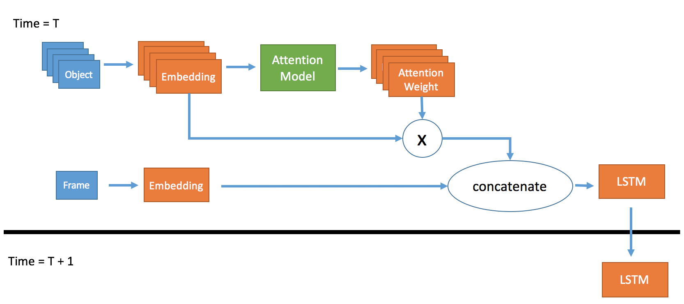

# Anticipating Accidents in Dashcam Videos
By Fu-Hsiang Chan, Yu-Ting Chen, Yu Xiang, Min Sun.

### Introduction

Anticipating Accidents in Dashcam Videos is initially described in a [ACCV 2016 paper](https://drive.google.com/file/d/0ByuDEGFYmWsbNkVxcUxhdDRVRkU/view).
We propose a Dynamic-Spatial-Attention (DSA) Recurrent Neural Network (RNN) for anticipating accidents in dashcam videos.

### Requirements

##### Tensoflow 1.x
##### Opencv 2.4.9
##### Matplotlib
##### Numpy

### Model Flowchart



### Dataset & Features

* Dataset : [link](http://aliensunmin.github.io/project/dashcam/) (Download the file and put it in "datatset/videos" folder.)

* CNN features : [link](https://drive.google.com/file/d/0B8xi2Pbo0n2gRGpzWUEzRTU2WUk/view?usp=sharing&resourcekey=0-e9lvHE70UAbFuVd79KWxZw) (Download the file and put it in "dataset/features" folder.)

* Annotation : [link](https://drive.google.com/file/d/0B8xi2Pbo0n2gdTlwT2NXdS1NTFE/view?usp=sharing&resourcekey=0-G5Vtj94Pdeiy1WJU84bcFA)

If you need the ground truth of object bounding box and accident location, you can download it.

The format of annotation:

<image name, track_ID, class , x1, y1, x2, y2, 0/1 (no accident/ has accident)>

### Usage

#### Run Demo
```
python accident.py --model ./demo_model/demo_model
```

#### Training
```
python accident.py --mode train --gpu gpu_id
```

#### Testing
```
python accident.py --mode test --model model_path --gpu gpu_id
```

### Citing

Please cite this paper in your publications if you use this code for your research:

    @inproceedings{chan2016anticipating,
        title={Anticipating accidents in dashcam videos},
        author={Chan, Fu-Hsiang and Chen, Yu-Ting and Xiang, Yu and Sun, Min},
        booktitle={Asian Conference on Computer Vision},
        pages={136--153},
        year={2016},
        organization={Springer}
    }
